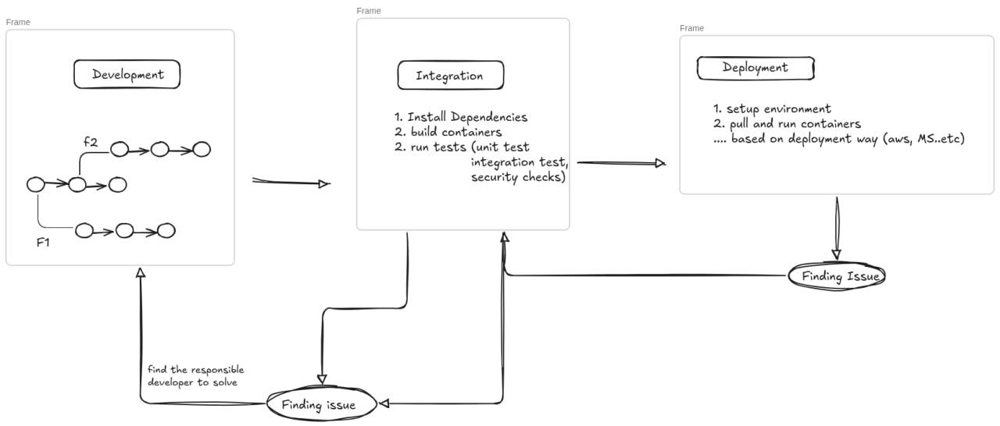
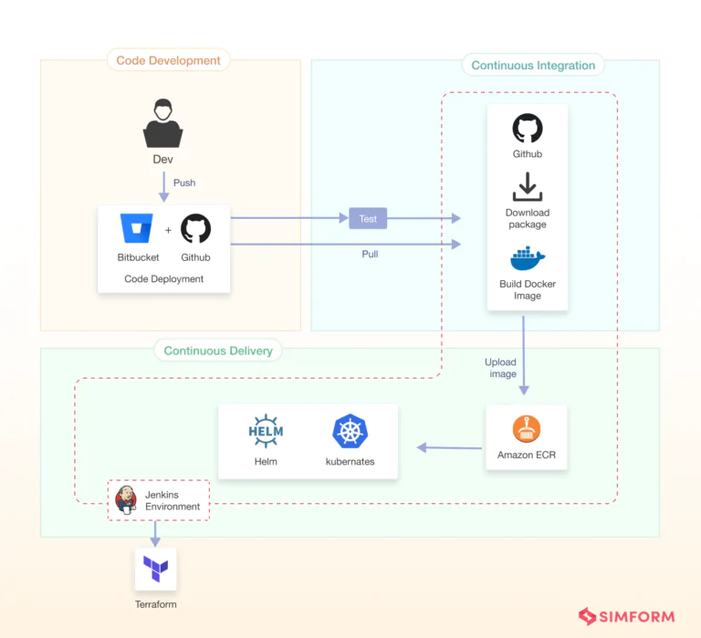

<!-- _class: lead -->

# CI/CD & GitHub Actions
---
## Content
- What is CI/CD?
- CI/CD Tools
- GitHub Actions
- NGINX
---
## How integration & Deployment Done in the past

<!-- Diagram about all software lifecycle in details -->
<!-- ![[attachments/presentation 2026-07-17 20.49.57.excalidraw]] -->



---
# What does CI/CD want to do?
## Continous Integration
every time I make a push -> pipeline check if this change integrate with the remain part of app and services (run tests)


## continous Delivery/Deployment
- The process of automatically deploying code to a production environment after passing all tests
- May involve human approval before production deployment in CD.
---

## CI/CD Pipline: example




---
<!-- _class: lead -->

# GitHub Actions
---
## What is GitHub Actions?

GitHub Actions is an automation platform built directly into GitHub. It allows you to automate your software development workflows right where your code lives!

**What can you do with it?**
- **CI/CD:** Automatically build, test, and deploy your code.
- **Task Automation:** Triage issues, label pull requests, and manage repository tasks.
- **Custom Workflows:** Trigger scripts on almost any event that happens in your repository.

---

## Core Concepts of GitHub Actions

GitHub Actions are driven by **Events** that happen in your repository:
- **Pull Requests** (e.g., opened, synchronized)
- **Issues** (e.g., created, commented on)
- **Commits** (e.g., code pushed to a branch)
- **Manual Triggers** (using `workflow_dispatch`)

*For every event, you can trigger a **Workflow**.*

---

## Anatomy of a Workflow

A Workflow is an automated process that contains one or more **Jobs**:
* **Jobs** run in parallel by default, but can be configured to run sequentially.
* Each job runs on a **Runner** (a virtual machine, e.g., Linux, Windows, macOS provided by GitHub, or self-hosted).
* A job contains **Steps**. Steps inside a job always run sequentially.

---

## Where do Workflows Live?

Workflows are defined using YAML files and must be placed in a specific directory in your repository:

```text
.github/
  └── workflows/
      └── my-workflow.yml
```

---

## A Basic Workflow Example

```yaml
name: Hello World

on:
  push:
    branches:
      - main
  pull_request:
    branches:
      - main
  workflow_dispatch:

jobs:
  hello_job:
    runs-on: ubuntu-latest
    steps:
      - uses: actions/checkout@v4
      - name: Say Hello
        run: echo "Hello World!"
        shell: bash

  goodbye_job:
    runs-on: ubuntu-latest
    steps:
      - name: Say Goodbye
        run: echo "Goodbye!"
        shell: bash
```

---

## Demystifying the YAML: Triggers & Naming

- **`name`**: (Optional) The name displayed in the GitHub UI.
- **`on`**: The events that trigger the workflow. 
  - *Tip*: `workflow_dispatch` allows manual UI triggers.

---

## Structuring Jobs

- **`jobs`**: Job IDs (e.g., `hello_job`). They cannot contain spaces!
- **`runs-on`**: The label of the runner machine (e.g., `ubuntu-latest`).

---

## Steps & Execution

- **`-` (Dash)**: Denotes an item in an array/list (like a list of `steps`).
- **`run`**: Executes a shell command on the runner.
- **`shell`**: (Optional) Specifies the shell to use, like `bash` or `pwsh`.

---

## Using Community Actions (`uses`)

Instead of writing scripts for everything, you can use pre-built actions!

```yaml
- uses: actions/checkout@v4
```

- **`uses`**: Tells the job to retrieve an action (e.g., checking out your repository code).
- **`@v4`**: Specifies the version. This can be a branch name, a Git tag (`v4`), or a specific commit SHA for security.

---

## Envrioment variables: `env`

Used to set environment variables that can be accessed by scripts within your workflow. You can set them at the workflow, job, or step level.

```yaml
jobs:
  test:
    runs-on: ubuntu-latest
    env:
      NODE_ENV: testing
    steps:
      - run: echo "Running in $NODE_ENV mode!"
```

---

## Conditional Execution: `if`

Allows you to conditionally execute a job or a step based on an expression. If the expression evaluates to false, the step is skipped.

```yaml
steps:
  - name: Run only on main branch
    if: github.ref == 'refs/heads/main'
    run: echo "Deploying to production!"
```

---

## Dependencies : `needs`

By default, jobs run in parallel. `needs` defines a dependency, ensuring a job only starts after the specified jobs complete successfully.

```yaml
jobs:
  build:
    runs-on: ubuntu-latest
    steps:
      - run: echo "Building..."

  deploy:
    needs: build
    runs-on: ubuntu-latest
    steps:
      - run: echo "Deploying after build!"
```


---

## What can you build with GitHub Actions?
1. **Automated Testing**: Run unit tests every time code is pushed.
2. **Issue Management**: Automatically reply to or label new issues.
3. **Deployment**: Build and deploy your application to staging or production automatically.

---

## Hands On 🚀
- create a simple workflow that automatically runs every time some one create pull request. It will check out your code and print a greeting!

**Prerequisites:**
- Do a repo contains Readme file.

---

## Step 1: Create the Workflow File

In your repository, create a new file exactly at this path:
`.github/workflows/hello.yml`

Paste the following YAML code:

```yaml
name: First Action

on: [push]

jobs:
  greet_job:
    runs-on: ubuntu-latest
    steps:
      - name: Checkout Code
        uses: actions/checkout@v4
      
      - name: Say Hello
        run: echo "Hello, Students! Your Action is running!"
```

---

## Step 2: Trigger & Verify

1. **Commit** the `hello.yml` file to the `main` branch.
2. The `push` event will automatically trigger the workflow.
3. Go to the **Actions** tab at the top of your GitHub repository.
4. Click on **"First Action"** on the left sidebar.
5. Click on the running job (`greet_job`) to watch the logs live!

🎉 *Congratulations! You've just built your first CI pipeline.*

---
<!-- _class: lead -->

# Deploying with NGINX
The powerhouse behind modern web applications.

---

## What is NGINX?

NGINX is a highly efficient tool that wears many hats. It acts as a single, secure entry point to your application, hiding your important backend servers from the public internet.

**Key Roles:**
1. **Web Server**: Serves static content (HTML, CSS, images) extremely fast.
2. **Reverse Proxy**: Sits between end-users and your backend, forwarding requests.
3. **Load Balancer**: Distributes heavy traffic evenly across multiple servers.
4. **Caching Server**: Temporarily stores data to speed up future requests.

---

## Why is NGINX so Efficient?

Traditional servers create a new "thread" for every user request, which consumes a lot of memory. NGINX does it differently:

- **Event-Driven & Asynchronous**: It handles thousands of concurrent connections within a **single thread**. 

**Everything in NGINX is controlled via a central configuration file called `nginx.conf`.**

---

## Deep Dive: NGINX as a Proxy Server

When used as a Reverse Proxy, NGINX supercharges your infrastructure by providing:
- **Load Balancing**: Ensuring no single backend server is overwhelmed.
- **SSL Termination**: Handling the heavy math of HTTPS encryption/decryption, freeing up your backend servers to focus on app logic.
- **Caching**: Returning saved responses to save database resources.
- **Global Traffic Management**: Redirecting users based on rules (e.g., routing `/api` traffic to one server and `/web` to another).


---

## Where Do We Write NGINX Configs?

If NGINX is installed directly on a server, its files live in `/etc/nginx/`.

1. **Global Settings (`/etc/nginx/nginx.conf`)**
   - The main configuration file.
   - Contains core settings (like `events {}`) and an `include` directive.
   - *Best Practice: Do not write your app configurations here!*

2. **App Settings (`/etc/nginx/conf.d/`)**
   - This is where you write your app's `server {}` blocks!
   - Create a file here (e.g., `my-app.conf`). NGINX will automatically read and include it when starting up.


---

## Basic Proxy Configuration

Here is a snippet showing how you configure a proxy in `nginx.conf`:

```nginx
server {
    listen 80; 
    
    location / {
        proxy_pass https://google.com:8080; 
    }
}
```


---


<!-- _class: lead -->
# Let's Deploy our App

---
**Resources**
- nginx: https://youtu.be/qqzL17vc5Gc?si=4Fv6hyO9mju_qZua
- Github actions: 
	- https://youtube.com/playlist?list=PLArH6NjfKsUhvGHrpag7SuPumMzQRhUKY&si=iJWmMWXNy1y4HBB4
	- https://youtu.be/7gJFHjXscr8?si=964lzjfc0sADOSMA


